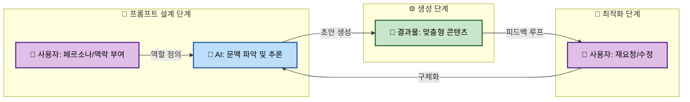
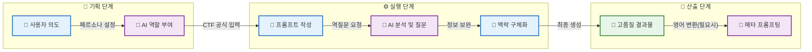
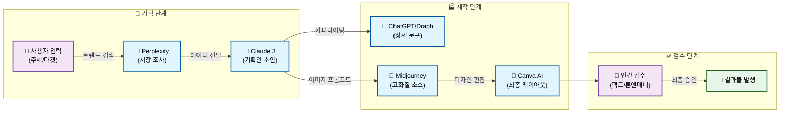
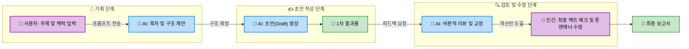
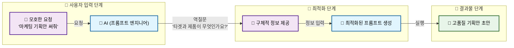

# AI 도구 200% 활용법: 프롬프트 엔지니어링부터 업무 자동화 실전 가이드

## Key Takeaways (3줄 요약)

### 핵심 요약: AI 활용의 패러다임 전환

AI 도구를 단순히 '더 빠른 검색 엔진'으로 사용하는 단계에서 벗어나, 업무 프로세스를 혁신하는 **전략적 파트너**로 격상시켜야 할 시점이다. 앞서 살펴본 다양한 도구와 기법들을 관통하는 핵심 인사이트를 세 가지 차원에서 정리한다.

---

### 1. 단순 검색을 넘어 '창작 파트너'로: 페르소나와 맥락의 힘

AI 활용의 성패는 프롬프트 엔지니어링, 그중에서도 **구체적인 페르소나(Persona)와 맥락(Context) 부여**에 달려 있다. AI를 단순한 질의응답 기계가 아닌, 내 팀의 '유능한 신입 사원'이나 '전문 컨설턴트'로 대우할 때 답변의 품질이 비약적으로 상승한다[1].

단순히 "기획안 작성해 줘"라고 명령하는 대신, "너는 10년 차 마케팅 임원이다(Persona). 이번 프로젝트의 타겟은 30대 직장인이고, 톤앤매너는 친근해야 한다(Context)"라고 지시하는 것이 핵심이다. 이는 AI가 방대한 데이터셋 내에서 적절한 어휘와 논리 구조를 인출하도록 유도하는 **In-Context Learning**의 일환이다[2].



### 2. 적재적소의 도구 배치: Vertical AI와 워크플로우 최적화

모든 업무를 하나의 LLM(예: ChatGPT)으로 해결하려는 시도는 비효율적이다. 업무의 목적에 따라 특화된 **Vertical AI** 도구를 적재적소에 배치하여 워크플로우를 구성해야 한다.

예를 들어, 이커머스 상품 상세 페이지 작성 시에는 일반 챗봇보다 '드랩아트(Draph Art)'와 같은 특화 솔루션이 브랜드 톤앤매너 유지와 이미지 생성에 유리하다[2]. 반면, 데이터 분석이나 코딩 보조가 필요할 때는 코드 인터프리터 기능이 강력한 모델을 선택해야 한다.

| 업무 영역 | 추천 접근 방식 (Workflow) | 특화 도구 예시 | 기대 효과 |
| :--- | :--- | :--- | :--- |
| **글쓰기/마케팅** | 초안 작성 및 카피라이팅 | Jasper, Copy.ai, 드랩아트[2] | 브랜드 보이스 일관성 유지 |
| **디자인/영상** | 텍스트 기반 시각화 | Midjourney, Canva AI, Runway ML[4] | 제작 시간 단축 및 시안 다양화 |
| **데이터/번역** | 정밀 분석 및 뉘앙스 번역 | DeepL, ChatGPT (Data Analysis)[4] | 정확도 향상 및 인사이트 도출 |

### 3. Human-in-the-Loop: 검증과 보안이 완성하는 200% 성과

AI는 강력한 도구이지만, 최종적인 책임과 판단은 인간의 몫이다. 이를 **Human-in-the-Loop(인간 참여형)** 프로세스라고 한다. AI가 생성한 결과물은 그럴듯해 보이지만 거짓 정보를 포함하는 '할루시네이션(Hallucination)' 가능성이 항상 존재하므로 팩트 체크는 필수다[1].

또한, 기업 데이터 보안은 타협할 수 없는 요소다. 업무 효율을 위해 무분별하게 사내 기밀이나 개인정보를 AI에 입력해서는 안 되며, 보안이 보장된 엔터프라이즈 버전을 사용하거나 민감 정보를 마스킹 처리하는 OCR 기술 등을 활용해야 한다[3].

> [!WARNING]
> **보안 주의사항**
> 무료 버전의 공개형 AI 모델에 회사의 재무 데이터, 고객 개인정보, 미공개 소스 코드를 입력하지 말 것. 입력된 데이터는 AI 모델의 학습 데이터로 재사용될 위험이 있다[5].

결국 AI 활용 능력은 도구 자체의 성능보다, 이를 비판적으로 검증하고 윤리적으로 판단하여 최종 결과물로 승화시키는 **사용자의 통찰력**에 의해 결정된다[5].

## AI를 포르쉐처럼 타는 법: 생성형 AI 프롬프트 잘 쓰는 법과 질문의 기술

### 핵심 요약

생성형 AI(Generative AI)는 사용자의 입력 값(Prompt)에 따라 성능 차이가 극명하게 갈리는 도구다. 많은 사용자가 AI를 단순한 검색 엔진처럼 사용하지만, 이를 '포르쉐'처럼 강력하게 운용하기 위해서는 **프롬프트 엔지니어링(Prompt Engineering)**의 핵심 원리를 이해해야 한다. 본 섹션에서는 전문가 수준의 답변을 이끌어내는 페르소나 설정, 구조화된 3단계 공식, 그리고 언어 장벽을 넘는 메타 프롬프팅 전략을 심층 분석한다.

---

### 1. 페르소나(Persona) 설정: AI에게 '자아'를 부여하라

단순한 지시는 일반적인 답변을 낳지만, 역할을 부여하면 AI는 해당 도메인의 전문 지식을 우선적으로 인출한다. 이를 **페르소나 설정**이라고 하며, AI 모델의 잠재 공간(Latent Space)에서 특정 맥락에 맞는 데이터 클러스터를 활성화하는 과정이다[1].

*   **일반 프롬프트:** "마케팅 기획안 써줘."
*   **페르소나 프롬프트:** "너는 10년 차 SaaS B2B 마케팅 디렉터다. 논리적이고 데이터 중심적인 사고를 하며, C-Level 임원들을 설득할 수 있는 톤앤매너를 유지하라."

> [!TIP]
> **구체성(Specificity)의 힘**: 단순히 "전문가"라고 지칭하기보다, 구체적인 연차, 직무, 그리고 성격(예: 비판적, 창의적)까지 지정할 때 답변의 품질이 비약적으로 상승한다.

### 2. 프롬프트 3단계 공식: CTF (Context, Task, Format)

원하는 결과물을 한 번에 얻기 위해서는 모호함을 제거해야 한다. 드랩아트(Draph Art)와 잔디(Jandi) 등의 분석에 따르면, AI의 성능은 구체적인 정보 제공과 형식 지정에 달려 있다[2][3]. 이를 체계화한 것이 **CTF 공식**이다.

| 단계 | 구성 요소 (Component) | 설명 및 예시 |
| :--- | :--- | :--- |
| **1** | **Context (맥락)** | AI가 상황을 이해하도록 배경 정보를 제공한다.<br>_예: "현재 우리 쇼핑몰의 30대 여성 고객 이탈률이 15% 증가했다."_ |
| **2** | **Task (지시)** | AI가 수행해야 할 구체적인 행동을 명시한다.<br>_예: "이탈 원인을 분석하고, 재방문을 유도할 수 있는 CRM 마케팅 메시지 3가지를 작성하라."_ |
| **3** | **Format (형식)** | 출력물의 형태와 분량을 지정한다.<br>_예: "이메일 제목과 본문 형식으로 구성하고, 친근한 말투(Tone)를 사용하라."_ |

#### 좋은 프롬프트 vs 나쁜 프롬프트 비교

| 구분 | 나쁜 프롬프트 예시 (Bad) | 좋은 프롬프트 예시 (Good) |
| :--- | :--- | :--- |
| **역할 부여** | "마케팅 글 써줘." | "너는 10년 차 퍼포먼스 마케터다. 30대 직장인을 타겟으로..." |
| **상황 설명** | "이거 요약해." | "다음 주 임원 보고용이다. 핵심 성과 위주로 3줄 요약해라." |
| **피드백** | "다시 써." | "톤이 너무 딱딱하다. 친근한 '해요체'로 바꾸고, 2번 항목을 더 강조하라." |

### 3. 역질문 유도(Reverse Questioning): 기획의 구멍 메우기

사용자가 제공한 정보가 불완전할 때, AI가 스스로 부족한 부분을 되묻게 만드는 기법이다. 이는 AI를 단순한 답변 기계가 아닌, 사고를 확장해주는 파트너로 활용하는 방법이다[1].

*   **프롬프트 예시:**
    > "이 프로젝트 기획안을 작성해 줘. **단, 작성을 시작하기 전에 내가 놓친 정보가 있거나 더 완벽한 결과를 위해 필요한 내용이 있다면 나에게 먼저 3가지 질문을 하라.**"

이 과정을 통해 사용자는 미처 생각하지 못한 변수를 점검하게 되며, 결과적으로 논리적 완결성이 높은 산출물을 얻을 수 있다.

### 4. 메타 프롬프팅(Meta-Prompting): 언어 장벽을 넘는 기술

미드저니(Midjourney)나 수노(Suno)와 같은 이미지·음악 생성 AI는 영어 프롬프트에서 훨씬 정교하게 작동한다. 영어가 익숙하지 않더라도 챗GPT와 같은 텍스트 AI에게 '프롬프트 작성자' 역할을 맡기면 고품질의 결과물을 얻을 수 있다[1].

*   **워크플로우:**
    1.  **챗GPT에게 요청:** "나는 1980년대 사이버펑크 스타일의 서울 야경 이미지를 미드저니로 만들고 싶다. 미드저니가 잘 이해할 수 있는 고품질의 영어 프롬프트를 작성하라. 조명, 앵글, 렌즈 효과 등을 포함할 것."
    2.  **결과 복사:** 챗GPT가 생성한 영어 프롬프트(예: `/imagine prompt: Cyberpunk style Seoul night view...`)를 복사.
    3.  **도구 적용:** 해당 프롬프트를 미드저니나 수노에 입력.

> [!NOTE]
> **할루시네이션(Hallucination) 주의**: AI가 생성한 정보는 그럴듯해 보이지만 사실이 아닐 수 있다. 특히 데이터나 인용문이 포함된 경우, 구글의 Gemini처럼 출처 링크를 제공하는 기능을 활용하거나 반드시 팩트 체크를 거쳐야 한다[1][5].

### 5. 프로세스 시각화: 고효율 프롬프트 워크플로우

다음은 위에서 설명한 기술들을 통합하여 최적의 결과물을 도출하는 프로세스다.



## 글쓰기부터 디자인까지: 업무 효율 높이는 무료 AI 추천 및 상황별 도구

### 핵심 요약

업무 효율을 극대화하기 위해서는 '만능 도구' 하나에 의존하기보다, 각 작업의 성격에 특화된 AI를 적재적소에 배치하는 전략이 필요하다. 텍스트 생성부터 디자인, 협업에 이르기까지 현재 시장에서 검증된 도구들의 장단점을 분석하고, 실무에 즉시 적용 가능한 선택 가이드를 제공한다.

---

### 1. 텍스트 생성 및 코딩: 논리적 추론 vs 범용성

텍스트 생성 AI는 업무의 기본이 되는 이메일 작성, 보고서 초안, 코딩 보조에 필수적이다. 현재 시장을 양분하고 있는 **Claude 3**와 **ChatGPT**는 비슷해 보이지만, 그 활용 목적에 따라 명확한 차이를 보인다.

| 비교 항목 | Claude 3 (Anthropic) | ChatGPT (OpenAI) |
| :--- | :--- | :--- |
| **핵심 강점** | **긴 문맥 이해(Context Window)** 및 뉘앙스 파악 | **범용성** 및 방대한 플러그인 생태계(GPTs) |
| **한국어 능력** | 문학적 표현, 자연스러운 번역투 지양 | 정보 전달 위주의 직관적 서술 |
| **코딩 능력** | 복잡한 로직 추론 및 리팩토링에 강점 | 코드 생성 속도 및 스니펫 제공에 유리 |
| **추천 대상** | 긴 논문 요약, 문맥이 중요한 작가, 시니어 개발자 | 데이터 분석, 이미지 인식(Vision) 병행, 일반 사무직 |

### 2. 이미지 및 영상 제작: 비전문가부터 전문가까지

시각 자료 제작은 AI 도입 시 시간 단축 효과가 가장 큰 영역이다. 사용자의 디자인 역량에 따라 도구를 구분하여 사용하는 것이 좋다.

#### 🎨 Canva AI (Magic Studio)
디자인 비전문가에게 가장 적합하다. 기존 템플릿에 AI 기능을 더해, "여름 분위기의 인스타그램 게시물 만들어줘"와 같은 텍스트 명령만으로 초안을 완성할 수 있다. 특히 소셜 미디어 콘텐츠 제작 시 **Magic Write** 기능을 활용하면 텍스트와 디자인을 동시에 해결 가능하다[2].

#### 🖼️ Midjourney (미드저니)
고품질의 예술적 이미지나 실사 같은 렌더링이 필요할 때 독보적이다. 사용법(Discord 기반)이 다소 까다롭지만, 광고 시안이나 브랜드 무드보드 제작 시 디자이너의 영감을 돕는 도구로 활용도가 높다.

#### 🎥 Runway ML
정지된 이미지를 영상으로 변환하거나, 텍스트로 영상을 생성하는 데 특화되어 있다. 영상 편집의 진입 장벽을 낮춰주며, 마케팅용 숏폼 콘텐츠 제작 시 배경 제거(Inpainting)나 스타일 변환 기능을 통해 전문 편집 툴 없이도 높은 퀄리티를 낼 수 있다[4].

> [!NOTE]
> **교차 활용 전략**: 영문 프롬프트 작성이 어려운 경우, ChatGPT나 Claude에게 "Midjourney에서 사용할 몽환적인 분위기의 프롬프트를 영어로 작성해 줘"라고 요청하여 도구 간 시너지를 낼 수 있다[1].

### 3. 번역 및 정보 탐색: 정확도와 실시간성의 결합

글로벌 비즈니스 환경에서는 단순 번역을 넘어선 '맥락 파악'과 '최신 정보'가 생명이다.

*   **DeepL**: 구글 번역보다 문맥 이해도가 월등히 높다. 특히 비즈니스 이메일이나 전문 용어가 포함된 문서 번역 시, 미묘한 뉘앙스 차이까지 잡아내어 수정 소요 시간을 획기적으로 줄여준다[4].
*   **Perplexity (퍼플렉시티)**: ChatGPT의 단점인 '최신 정보 부재'를 해결한다. 실시간 웹 검색을 기반으로 답변을 생성하며, 정보의 출처(Source)를 명확히 표기하므로 시장 조사나 트렌드 리포트 작성 시 할루시네이션 위험을 줄일 수 있다.

### 4. 버티컬(Vertical) AI: 특정 산업에 특화된 도구

범용 AI가 해결하지 못하는 세밀한 니즈는 특정 산업에 특화된 버티컬 AI가 해결한다.

#### 🛍️ 이커머스: 드랩아트 (Draph Art)
상품 사진의 배경을 제거하고 AI 모델을 합성하거나, 상품 상세 페이지 카피를 자동으로 생성해 준다. 일반적인 LLM과 달리 '구매 전환'에 최적화된 마케팅 문구를 생성하며, 브랜드 고유의 톤앤매너를 학습시킬 수 있어 쇼핑몰 운영자의 리소스를 대폭 절감한다[2].

#### 🏢 협업 및 보안: 잔디 (JANDI)
국내 업무용 메신저 잔디는 AI 기능(스프링클러)을 통해 협업 효율을 높인다. 업무 대화방의 내용을 요약하거나, OCR 기능을 통해 이미지 내 텍스트를 추출하여 보안 걱정 없이 사내 데이터베이스로 활용할 수 있게 돕는다[3].

### 5. 업무 프로세스 최적화 워크플로우

다음은 콘텐츠 마케팅 업무를 예시로, 위에서 언급한 도구들을 유기적으로 연결하여 효율을 200% 높이는 워크플로우다.



> [!WARNING]
> **검증의 중요성**: AI는 훌륭한 조수이지만, 최종 결정권자는 아니다. 특히 데이터나 인용문이 포함된 결과물은 반드시 원본 출처를 확인(Fact Check)하는 습관을 들여야 하며, AI가 생성한 결과물을 그대로 복사해서 사용하는 것은 지양해야 한다[1][5].

## 챗GPT 실전 활용 꿀팁: 할루시네이션 검증과 워크플로우 최적화

### 핵심 요약 (Executive Summary)

이 섹션에서는 생성형 AI(Generative AI)를 단순한 검색 도구가 아닌, 실무 파트너로 격상시키기 위한 구체적인 방법론을 다룬다. **할루시네이션(Hallucination)** 리스크를 기술적으로 제어하는 검증 프로세스, 업무 시간을 획기적으로 단축하는 **순환형 워크플로우(Iterative Workflow)**, 그리고 기업 환경에서 필수적인 **데이터 보안 수칙**을 분석한다.

---

### 1. 할루시네이션 제로(0)에 도전하는 '팩트 체크' 프로세스

AI가 그럴듯한 거짓말을 생성하는 '할루시네이션' 현상은 실무 도입의 가장 큰 장벽이다. 특히 숫자, 인용문, 최신 데이터와 같은 정량적 정보에서 오류가 발생할 경우 비즈니스 리스크로 직결된다. 이를 방지하기 위해 전문가는 다음과 같은 **이중 검증(Double-Check)** 메커니즘을 사용해야 한다.

#### 출처(Source) 기반의 검증 요청
단순히 질문을 던지는 것을 넘어, 답변의 근거가 되는 출처를 명시하도록 요구해야 한다. 구글의 제미나이(Gemini)나 챗GPT의 브라우징 기능을 활용할 때, 답변 하단에 생성된 링크를 직접 클릭하여 원문과 대조하는 습관이 필요하다[1].

> [!TIP]
> **검증을 위한 프롬프트 예시:**
> "이 보고서에 포함된 시장 점유율 데이터의 구체적인 출처(URL)를 각 항목 옆에 명시해 줘. 만약 확실한 출처가 없다면 해당 데이터는 제외하라."

#### 교차 검증(Cross-Validation)
AI는 확률에 기반하여 단어를 조합하므로, 논리적 오류가 발생할 수 있다. 중요한 의사결정 전에는 AI가 생성한 결과값을 다른 AI 모델(예: GPT-4 결과물을 Claude 3로 검증)에 입력하여 오류를 체크하거나, 원본 데이터와 대조하는 과정이 필수적이다[5].

---

### 2. 1시간 업무를 10분으로: 순환형 워크플로우(Iterative Workflow)

많은 사용자가 AI에게 한 번의 명령으로 완벽한 결과물을 기대하지만, 이는 비효율적이다. AI 활용의 핵심은 **'초안 작성(Drafting) -> AI 피드백(Review) -> 인간의 수정(Refining)'**으로 이어지는 순환 구조에 있다.

AI를 도구가 아닌 **'신입 사원'**으로 대우해야 한다. 신입 사원에게 업무를 지시하고 피드백을 주고받으며 결과물을 발전시키듯, AI와도 대화를 통해 결과물을 점진적으로 고도화해야 한다[1].

#### 실전 워크플로우 시각화
아래 다이어그램은 기획부터 최종 산출물까지의 최적화된 프로세스를 보여준다.



이 프로세스를 따르면 인간은 '백지 공포(Blank Page Syndrome)'에서 벗어나 고차원적인 판단과 수정에만 집중할 수 있어 생산성이 200% 이상 향상된다[3].

---

### 3. 기업 환경을 위한 보안 수칙: OCR과 데이터 격리

기업 실무자가 AI를 사용할 때 가장 주의해야 할 점은 **보안**이다. 민감한 사내 데이터나 개인정보(PII)를 퍼블릭 AI 모델에 직접 입력하는 것은 데이터 유출 사고로 이어질 수 있다.

> [!WARNING]
> **절대 입력 금지 항목:**
> 주민등록번호, 전화번호, 미공개 재무 데이터, 사내 기밀 프로젝트명, 소스 코드(Proprietary).

#### 안전한 데이터 추출을 위한 OCR 활용
보안이 중요한 문서를 분석해야 할 때는 원본 파일을 그대로 업로드하기보다, **OCR(광학 문자 인식)** 기능을 활용하여 필요한 텍스트 데이터만 추출한 뒤 비식별화(De-identification) 과정을 거쳐 입력하는 것이 안전하다. 최근 협업툴 잔디(JANDI)와 같은 서비스들은 보안 걱정 없이 파일 내 정보를 분석하고 추출하는 기능을 제공하여 이러한 리스크를 줄이고 있다[3].

## 자주 묻는 질문 (FAQ)

### 핵심 요약 (Executive Summary)

AI 도입을 고려하는 실무자들이 가장 많이 고민하는 4가지 핵심 질문에 대한 기술적 분석과 가이드를 정리했다.

*   **비용 효율성:** 단순 텍스트 작업은 무료로 충분하나, 데이터 분석 및 멀티모달 기능이 필요하다면 유료 구독이 필수적이다.
*   **데이터 보안:** 퍼블릭 AI 모델 학습 방지 설정(Opt-out)은 필수이며, 민감 정보는 엔터프라이즈 솔루션을 권장한다.
*   **프롬프트 학습:** 복잡한 이론보다 'AI에게 프롬프트 작성을 요청하는' 메타 프롬프팅 방식이 가장 빠른 학습법이다.
*   **저작권 이슈:** 플랫폼 약관상 상업적 이용은 대부분 가능하나, 결과물에 대한 독점적 저작권 인정 여부는 별개의 법적 문제다.

---

### Q1. 유료 버전(ChatGPT Plus 등)을 꼭 써야 하나?

무료 버전(예: GPT-4o mini)과 유료 버전(GPT-4o, o1-preview, Claude 3.5 Sonnet 등)의 가장 큰 차이는 **'추론 능력(Reasoning)'**과 **'멀티모달 처리 용량'**에 있다. 단순히 이메일 초안을 작성하거나 번역을 하는 용도라면 무료 버전으로도 충분하다. 하지만 업무 효율을 200% 끌어올리기 위해서는 유료 버전의 고급 기능이 필요할 때가 많다.

특히, 복잡한 논리적 사고가 필요한 데이터 분석이나 코딩, 그리고 대용량 문서를 한 번에 처리해야 하는 경우 유료 모델의 성능 차이가 확연하다[1][4].

| 비교 항목 | 무료 버전 (Free Tier) | 유료 버전 (Plus/Team/Pro) | 추천 대상 |
| :--- | :--- | :--- | :--- |
| **모델 성능** | 경량화 모델 (속도 중심) | 최상위 모델 (추론/논리 중심) | 복잡한 기획, 코딩 |
| **데이터 처리** | 텍스트 위주, 소량 파일 | 대용량 파일(PDF, Excel) 분석 | 데이터 분석가, 마케터 |
| **멀티모달** | 제한적 이미지 생성/분석 | DALL-E 3, 고급 비전 인식 | 디자이너, 콘텐츠 제작자 |
| **보안/속도** | 일반 속도, 학습 데이터로 사용될 수 있음 | 빠른 속도, 데이터 보안 옵션 제공 | 기업 실무자 |

> [!TIP]
> **결정 가이드:** 하루에 3회 이상 AI에게 "이 엑셀 파일을 분석해 줘"라거나 "이 기획안의 논리적 허점을 찾아줘"와 같은 심층적인 질문을 던진다면, 유료 구독이 비용 대비 생산성(ROI) 측면에서 훨씬 유리하다.

---

### Q2. 회사 업무 내용을 AI에 입력해도 보안상 문제가 없나?

가장 민감한 주제다. 기본적으로 ChatGPT나 Claude 같은 퍼블릭 AI 서비스의 무료 버전은 사용자의 대화 내용을 모델 학습(Training)에 사용할 수 있다. 따라서 **개인식별정보(PII), 회사의 대외비(Trade Secrets), 미공개 재무 데이터**는 절대 입력해서는 안 된다[3][5].

하지만 데이터를 학습하지 못하도록 설정하는 방법이 존재한다.

1.  **학습 방지 설정 (Data Controls):** ChatGPT의 경우 `Settings` > `Data controls` > `Improve the model for everyone` 옵션을 **Off**로 설정하면 대화 내용이 모델 학습에 사용되지 않는다.
2.  **API 및 엔터프라이즈 사용:** API를 통해 데이터를 전송하거나 ChatGPT Enterprise/Team 요금제를 사용할 경우, 기본 정책상 입력 데이터는 학습에 사용되지 않으며 엔터프라이즈급 보안이 적용된다.

> [!WARNING]
> **보안 주의사항:** 학습 방지 설정을 하더라도, AI가 생성한 답변에 '환각(Hallucination)'이 포함될 수 있으므로 팩트 체크는 필수다. 특히 숫자가 포함된 재무 보고서나 인용 출처는 반드시 원본과 대조해야 한다[1].

---

### Q3. 프롬프트 엔지니어링을 따로 배워야 하나?

프롬프트 엔지니어링은 중요하지만, 초보자가 복잡한 이론부터 배울 필요는 없다. 가장 빨리 감을 잡는 방법은 **"AI를 사람처럼 대하고, AI에게 프롬프트 작성을 시키는 것(Meta-Prompting)"**이다[1].

AI를 갓 입사한 똑똑한 인턴이라고 생각하라. 구체적인 상황(Context), 역할(Persona), 원하는 형식(Format)을 명확히 줄수록 결과가 좋아진다[2]. 만약 어떻게 질문해야 할지 모르겠다면, 아래의 프로세스처럼 AI에게 역으로 질문을 던지게 하라.



**초보자를 위한 치트키 프롬프트:**
> "나는 [화장품]을 파는 마케터다. [30대 여성]을 타겟으로 블로그 글을 쓰려고 한다. 네가 전문 프롬프트 엔지니어라고 생각하고, 내가 최상의 결과물을 얻기 위해 너에게 입력해야 할 완벽한 프롬프트를 먼저 작성하라."

이 방식을 사용하면 AI가 스스로 문맥을 파악하고 필요한 정보를 되물어보며, 결과적으로 가장 적합한 프롬프트를 만들어준다[1].

---

### Q4. AI 결과물을 상업적으로 이용할 때 저작권 문제는 없나?

이커머스 상세페이지나 유튜브 스크립트 등에 AI 결과물을 사용하는 것은 **대부분의 유료 플랫폼 약관상 허용**된다. 예를 들어, OpenAI(ChatGPT, DALL-E)나 Midjourney(유료 플랜)는 사용자가 생성한 콘텐츠에 대한 상업적 소유권을 사용자에게 양도한다고 명시하고 있다[2].

하지만 여기서 두 가지 중요한 법적 쟁점을 구분해야 한다.

1.  **약관상 이용 권한:** 플랫폼이 사용자에게 상업적 이용을 허락했는가? → **YES** (대부분의 유료 플랜)
2.  **저작권 인정 여부:** 내가 만든 AI 결과물이 법적으로 '나만의 창작물'로 보호받는가? → **NO** (현재 한국 및 미국 저작권청은 인간의 창작적 개입이 없는 순수 AI 생성물의 저작권을 인정하지 않는 추세다.)

> [!NOTE]
> **상표권 침해 주의:** AI가 생성한 로고나 이미지가 기존의 유명 브랜드(예: 나이키 로고, 미키마우스 등)와 유사하게 생성될 경우, 이를 상업적으로 사용하면 상표권 침해 소송을 당할 수 있다. 상업적 이용 전에는 반드시 구글 이미지 검색 등을 통해 유사성 검토를 거치는 것이 안전하다.

<!-- FAQ Schema for SEO -->
```html
<script type="application/ld+json">
{
  "@context": "https://schema.org",
  "@type": "FAQPage",
  "mainEntity": [
    {
      "@type": "Question",
      "name": "유료 버전(ChatGPT Plus 등)을 꼭 써야 하나요?",
      "acceptedAnswer": {
        "@type": "Answer",
        "text": "단순 텍스트 작업은 무료 버전으로 충분하지만, 복잡한 데이터 분석, 대용량 파일 처리, 고품질 이미지 생성이 필요한 업무에는 유료 버전(GPT-4o, Claude 3.5 Sonnet 등)이 필수적이다. 특히 추론 능력이 요구되는 기획 및 코딩 업무에서 큰 차이를 보인다."
      }
    },
    {
      "@type": "Question",
      "name": "회사 업무 내용을 AI에 입력해도 보안상 문제가 없나요?",
      "acceptedAnswer": {
        "@type": "Answer",
        "text": "무료 버전의 퍼블릭 AI는 입력 데이터를 학습에 사용할 수 있어 민감 정보 입력 시 주의가 필요하다. 설정에서 '학습 방지(Opt-out)' 기능을 켜거나, 데이터 보안이 보장되는 엔터프라이즈(Enterprise) 요금제 또는 API를 사용하는 것을 권장한다."
      }
    },
    {
      "@type": "Question",
      "name": "프롬프트 엔지니어링을 따로 배워야 할까요?",
      "acceptedAnswer": {
        "@type": "Answer",
        "text": "깊이 있는 이론 학습보다는 AI에게 직접 프롬프트를 작성해달라고 요청하는 '메타 프롬프팅' 방식이 가장 빠르다. AI에게 역할(Persona)과 상황(Context)을 부여하고, 부족한 정보를 AI가 역으로 질문하게 만드는 것이 효과적이다."
      }
    },
    {
      "@type": "Question",
      "name": "AI가 작성한 글이나 이미지를 상업적으로 이용할 때 저작권 문제는 없나요?",
      "acceptedAnswer": {
        "@type": "Answer",
        "text": "대부분의 유료 AI 플랫폼은 약관상 결과물의 상업적 이용을 허용한다. 단, 순수 AI 생성물은 현행법상 저작권 보호를 받지 못할 수 있으며, 기존 브랜드와 유사한 이미지가 생성될 경우 상표권 침해 소지가 있으므로 검토가 필요하다."
      }
    }
  ]
}
</script>
```

## References
[1] 답변 퀄리티 200% 올리는 #AI 사용법, 10가지 가져왔습니다 - YouTube: https://www.youtube.com/watch?v=Oes1w7rs6vY

[2] 글쓰기 AI 사이트 추천 및 200% 활용법 (2025년 최신) | Draph Art: https://draph.art/blog/insights/ai_writing_sites_complete_guide

[3] 요즘 직장인을 위한 업무 효율 200% 올리는 AI 활용법: https://blog.jandi.com/ko/2024/12/20/sprinkler-usageguide/

[4] AI 활용법 완벽 정리! 초보자를 위한 AI 입문 가이드 - 유쌤Ai: https://yusamlog.tistory.com/entry/AI-%ED%99%9C%EC%9A%A9%EB%B2%95-%EC%99%84%EB%B2%BD-%EC%A0%95%EB%A6%AC-%EC%B4%88%EB%B3%B4%EC%9E%90%EB%A5%BC-%EC%9C%84%ED%95%9C-AI-%EC%9E%85%EB%AC%B8-%EA%B0%80%EC%9D%B4%EB%93%9C

[5] AI를 최대한 활용하는 방법: 스스로에게 물어봐야 할 4가지 질문 - BBC: https://www.bbc.com/korean/articles/cy0wvxkr02vo