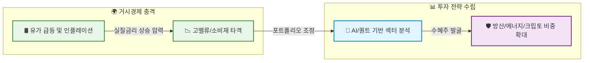
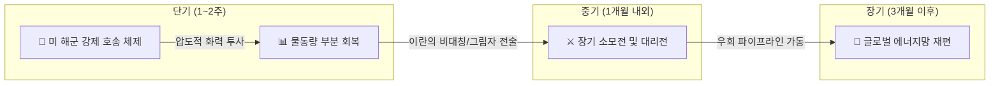
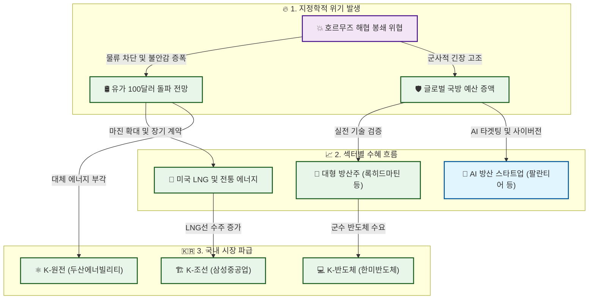
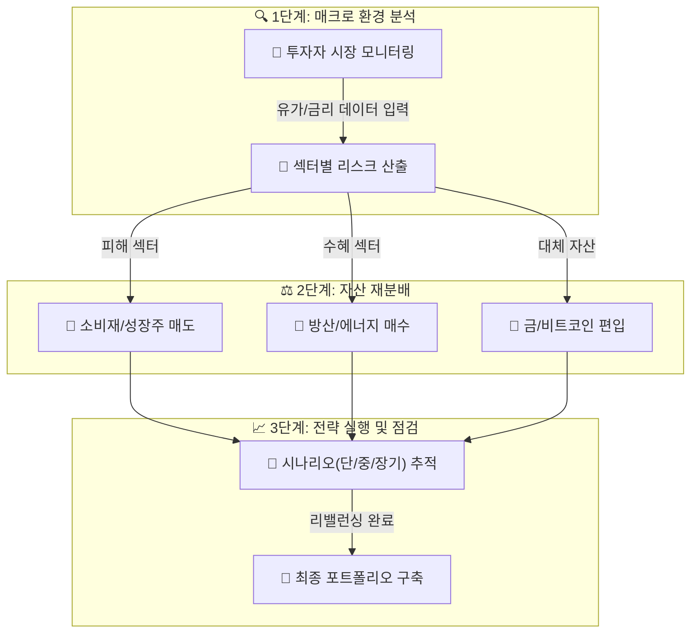
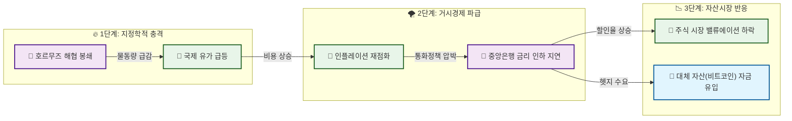

# 미국-이란 전쟁 발발: 호르무즈 쇼크에 대응하는 완벽한 투자 전략 가이드

## Key Takeaways (3줄 요약)

**핵심 요약**
* **거시경제 리스크 확대:** 미국과 이란의 직접적인 군사 충돌 및 호르무즈 해협 봉쇄 우려로 인해 글로벌 유가가 급등하고 있으며, 이는 전방위적인 인플레이션 재점화 및 실질금리 상승 리스크로 이어지고 있습니다 [1].
* **핵심 수혜 섹터 부상:** 록히드마틴 등 전통 대형 방산주와 AI 기반 방산 기술 기업, 천연가스(LNG) 관련주, 그리고 지정학적 헤지 수단으로 부각된 크립토 자산이 포트폴리오의 핵심 방어 기제로 작용하고 있습니다 [1], [2], [4].
* **선제적 리밸런싱 필수:** 유가 급등의 직격탄을 맞는 항공·여행, 경기민감 소비재 및 금리 인하 기대감 소멸로 밸류에이션 압박을 받는 고밸류 성장주의 비중을 축소하고, 사태 장기화에 대비한 포트폴리오 재편이 시급합니다 [1].

---

### 1. 거시경제 충격과 인플레이션 재점화 리스크

미국과 이스라엘의 이란 본토 타격과 이에 맞선 이란 혁명수비대(IRGC)의 호르무즈 해협 실질적 봉쇄 위협은 글로벌 에너지 공급망에 치명적인 타격을 가하고 있습니다 [1]. 전 세계 원유 및 액화천연가스(LNG) 물동량의 약 20%가 통과하는 호르무즈 해협의 마비는 브렌트유를 단기적으로 80달러 중반까지 끌어올렸으며, 사태 장기화 시 배럴당 100달러를 상회할 가능성도 제기됩니다 [1], [5]. 

이러한 에너지 가격의 급등은 단순히 기업의 제조 원가 상승에 그치지 않고, 글로벌 인플레이션을 재가속화하여 중앙은행의 금리 인하 기대를 소멸시킵니다. 웰스파고(Wells Fargo) 등 주요 투자은행은 유가 100달러 이상 및 해협 봉쇄 장기화 시 S&P 500 지수가 현 수준 대비 약 15% 하락할 수 있다는 극단적 시나리오까지 열어두고 있습니다 [1].

> [!WARNING] 
> **스태그플레이션 리스크 경계**
> 유가 120달러 이상의 극단적 시나리오가 현실화될 경우, 실질 소득 감소에 따른 소비 둔화(경기침체)와 물가 상승(인플레이션)이 동시에 발생하는 스태그플레이션 국면에 진입할 수 있으므로 철저한 리스크 관리가 요구됩니다 [1].

### 2. 지정학적 위기 속 핵심 수혜 섹터

전쟁이라는 극단적인 지정학적 위기 속에서 자본은 명확한 수혜처로 빠르게 이동하고 있습니다. 월가 금융계는 갈등 장기화 시나리오를 반영하여 특정 섹터의 비중을 공격적으로 확대 중입니다 [4].

* **방위산업 (전통 및 첨단 AI):** 록히드마틴(Lockheed Martin), 노스롭그루먼(Northrop Grumman), RTX 등 대형 방산주는 국방 예산 증액 기대감에 힘입어 급등세를 보이고 있습니다 [1], [3]. 특히 이번 분쟁에서는 무인기, 미사일, 센서 등을 다루는 에어로바이론먼트(AeroVironment)나 AI 기반 타겟팅 시스템을 제공하는 팔란티어(Palantir), 안두릴(Anduril) 등 4차 산업혁명 기반의 방산 기술 기업들이 새로운 주도주로 부상하고 있습니다 [1], [4].
* **에너지 및 LNG:** 엑손모빌(ExxonMobil), 셰브론(Chevron) 등 전통 석유 기업뿐만 아니라, 유럽의 카타르 LNG 가동 중단 우려와 맞물려 미국의 대형 LNG 수출 기업들이 구조적 수혜를 입고 있습니다 [1], [2].
* **크립토 자산:** 비트코인(Bitcoin)을 비롯한 암호화폐는 기존의 위험자산 성격을 넘어, 인플레이션 및 지정학적 위기를 방어하는 '디지털 금'으로서의 내러티브가 강화되며 단기 급등세를 연출하고 있습니다 [1].

### 3. 피해 섹터 점검 및 선제적 포트폴리오 리밸런싱

에너지 충격은 시장을 '에너지 생산국(수혜)'과 '에너지 수입국(피해)'의 구도로 양분하고 있습니다 [5]. 이에 따라 투자자들은 피해가 예상되는 섹터의 비중을 기계적으로 축소해야 합니다.

| 구분 | 대상 섹터 | 타격 원인 및 펀더멘털 분석 |
| :--- | :--- | :--- |
| **직접 피해** | 항공, 여행, 운송 | 제트유 등 연료비 비중 급상승으로 인한 마진 압박 및 지정학적 불안에 따른 글로벌 수요 위축 [1] |
| **간접 피해** | 경기민감 소비재 | 에너지 비용 및 물가 상승으로 인한 가계의 실질 소득 감소, 잉여 소비 여력 축소 직결 [1] |
| **밸류에이션 타격** | 고밸류 장기 듀레이션 성장주 | 인플레이션 고착화로 인한 실질금리 상방 압력 확대, 미래 현금흐름의 현재가치 할인율 상승으로 밸류에이션 압축(Multiple Compression) 발생 [1] |

> [!TIP]
> **포트폴리오 조정 전략**
> 과거 단기 지정학적 이벤트는 통상 1개월 내 증시가 회복되는 V자 반등 패턴을 보였으나, 이번 사태는 '유가 급등 + 해협 봉쇄 + 확전 리스크'가 결합된 복합 위기입니다 [1]. 맹목적인 저가 매수(Buy the dip)보다는 펀더멘털이 훼손된 소비재와 고밸류 주식을 덜어내고, 현금 비중 확대 및 방산/에너지 바벨 전략을 취하는 것이 유리합니다.

#### 📊 위기 대응 포트폴리오 리밸런싱 프로세스



## 중동 지정학적 리스크 고조: 미국 이란 전쟁 투자 전략과 글로벌 경제 파장

**핵심 요약 (Summary)**
이번 미국과 이란의 군사적 충돌은 단순한 국지전을 넘어 글로벌 에너지 공급망의 핵심인 호르무즈 해협의 실질적 봉쇄로 이어지고 있습니다. 월가 주요 투자은행들은 유가 급등과 경제 성장 둔화가 맞물리는 '스태그플레이션(Stagflation)' 시나리오를 바탕으로 자산 배분 전략을 전면 수정 중입니다. 과거의 단기 충격 후 V자 반등 패턴과 달리, 이번 사태는 미국의 압도적 화력과 이란의 비대칭 전력이 맞붙는 장기 소모전 양상을 띠고 있어 투자자들의 각별한 주의가 요구됩니다.

### 호르무즈 해협 실질적 봉쇄와 글로벌 인플레이션 재가속 우려

미국과 이스라엘의 이란 본토 및 군사·에너지 시설 공습으로 촉발된 중동의 지정학적 리스크가 최고조에 달하고 있습니다 [1]. 특히 이란 혁명수비대(IRGC)의 위협과 실제 유조선 피격 사건이 발생하면서, 전 세계 원유 및 액화천연가스(LNG) 물동량의 약 20%가 통과하는 호르무즈 해협은 사실상 '실질적 봉쇄' 국면에 진입했습니다 [1, 5]. 

국제법상 공식적인 봉쇄 선언이 내려진 것은 아니지만, 통과를 감행하는 민간 선박이 사라지면서 브렌트유 가격은 단기간에 70달러 초반에서 80달러 중반까지 급등했습니다 [1]. 이러한 에너지 가격의 발작적 상승은 글로벌 인플레이션의 재가속 우려로 직결되며, 연방준비제도(Fed)의 금리 인하 기대감을 후퇴시키고 주식, 채권, 원자재 등 전 자산군의 변동성을 극대화하고 있습니다 [1].

### 월가(Wall Street)의 시나리오 재수정: 스태그플레이션 리스크

현재 월가의 주요 투자은행(IB)들과 옵션 시장 참여자들은 이번 사태를 단순한 지정학적 노이즈가 아닌 펀더멘털의 구조적 변화로 인식하고 있습니다. 

> [!WARNING] 
> **스태그플레이션 경계령**
> 유가가 100달러 이상으로 장기화될 경우, 기업의 마진 압박과 가계의 실질 소득 감소가 동시에 발생하여 '유가 상방 리스크와 성장 하방 리스크'가 결합된 스태그플레이션이 현실화될 수 있습니다 [1].

웰스파고(Wells Fargo) 등 일부 기관은 호르무즈 봉쇄가 장기화되고 유가가 100달러를 상회하는 극단적 시나리오에서 S&P 500 지수가 현 수준 대비 약 15% 하락할 가능성까지 열어두고 있습니다 [1]. 이에 따라 글로벌 자금은 고밸류에이션 성장주에서 이탈하여 방산, 에너지, 그리고 인플레이션 헤지 자산으로 빠르게 이동하는 포트폴리오 전면 재수정 작업에 돌입했습니다 [1, 4].

### 군사적 충돌 양상과 시계열별 전개 시나리오

미국은 항공모함 전단과 스텔스 폭격기 등 최첨단 무기를 동원한 압도적 화력을 자랑하는 반면, 이란은 혁명수비대와 친이란 무장세력을 활용한 '그림자 전술(Shadow Tactics)' 및 대리전 등 비대칭 전력으로 맞서고 있습니다 [3]. 이러한 양국의 군사적 특성으로 인해 사태는 단기전으로 끝나기보다 복잡한 시계열적 전개를 보일 확률이 높습니다 [2].



1. **단기 (1~2주) - 강제 호송(Convoy) 체제**: 미군은 항모 전단의 화력을 바탕으로 이란 해안 기지를 타격하고, 민간 유조선을 군함이 호위하는 작전을 전개할 것입니다. 이 시기 물동량은 평소의 20~30% 수준으로 일부 회복될 수 있으나 운임 변동성은 극심할 것입니다 [2].
2. **중기 (1개월 내외) - 장기 소모전 진입**: 이란이 전면전을 피하면서도 기뢰 부설이나 드론을 활용한 간헐적 타격을 지속할 경우, 높은 보험료와 물류비용이 고착화되는 '뉴 노멀(New Normal)' 상태에 빠지게 됩니다 [2, 3].
3. **장기 (3개월 이후) - 대체 경로 확보**: 사태가 장기화되면 아시아 국가들은 사우디 동서 파이프라인 등 호르무즈를 우회하는 경로를 적극 활용하게 되며, 글로벌 에너지 공급망의 구조적 재편이 일어날 것입니다 [2].

### 과거 지정학적 위기와의 차이점: V자 반등이 어려운 이유

역사적으로 주식 시장은 중동의 지정학적 이벤트 발생 시 통상 1개월 내에 충격을 흡수하고 이전 지수를 회복(V자 반등)하는 패턴을 보여왔습니다 [1]. 그러나 이번 미국-이란 전쟁은 과거의 단순 무력 충돌과는 궤를 달리합니다.

| 구분 | 과거 일반적 지정학적 위기 | 현재 미국-이란 전쟁 (호르무즈 쇼크) |
| :--- | :--- | :--- |
| **핵심 리스크** | 국지적 군사 충돌 및 단기 심리 위축 | 글로벌 에너지 핵심 물류망(호르무즈) 실질적 봉쇄 [1] |
| **거시경제 환경** | 저물가 또는 안정적 금리 환경 | 인플레이션 재가속 우려 및 고금리 장기화 리스크 [1] |
| **전쟁의 양상** | 정규전 중심의 단기 결전 | 첨단 무기(미국) vs 비대칭 대리전(이란)의 복합 소모전 [3] |
| **시장 회복 패턴** | 1개월 내 S&P 500 V자 반등 | 유가 급등과 확전 리스크 결합으로 지루한 L자형 또는 W자형 변동성 장세 예상 [1] |

> [!TIP] 
> **투자 전략 인사이트**
> 과거의 '지정학적 위기는 매수 기회'라는 단순한 공식에 의존하기보다는, 방산주(록히드마틴, 노스롭그루먼 등)와 하방이 경직된 LNG 관련 에너지 기업으로 포트폴리오를 방어하면서 거시경제 지표(CPI, 유가 추이)를 확인하며 보수적으로 접근해야 합니다 [1, 2, 4].

## 국제 유가 전망 및 호르무즈 해협 관련주: 에너지 및 방산주 수혜주 분석

**핵심 요약**
- **에너지 섹터**: 유가 100달러 돌파 및 장기화 시나리오가 대두됨에 따라 엑손모빌, 셰브론 등 전통 석유 기업과 장기 계약 기반의 미국 LNG 수출 기업이 강력한 수혜주로 부상하고 있습니다.
- **방산 섹터**: 실전 기술 검증과 국방 예산 증액 기대로 록히드마틴 등 글로벌 대형 방산주가 급등 중이며, 팔란티어 등 AI 방산 스타트업으로 스마트머니가 유입되고 있습니다.
- **국내 수혜주**: 한미반도체, 두산에너빌리티, 삼성중공업 등 군수, 원자력, 조선 관련 기업들이 호르무즈 해협 관련주로 부각되며 강세를 보이고 있습니다.

---

### 극단적 유가 시나리오와 전통 에너지 기업의 부상

미국과 이란의 군사적 충돌로 인해 호르무즈 해협 봉쇄가 현실화되면서, 월가 주요 투자은행(IB)들은 브렌트유 100달러 돌파 및 장기화 시나리오를 기정사실화하고 있습니다 [1]. 특히 유가가 120~130달러에 이르는 극단적 시나리오에서는 글로벌 경기침체와 높은 인플레이션이 동시 발생할 가능성이 제기되고 있습니다 [1].

이러한 지정학적 위기 속에서 엑손모빌(ExxonMobil)과 셰브론(Chevron) 등 전통 석유 기업들은 12%대 이상의 강세를 보이며 강력한 수혜주로 부각되었습니다 [1]. 마라톤(Marathon)과 발레로(Valero)와 같은 정유주 역시 정제 마진 확대 기대감에 목표주가가 상향 조정되는 추세입니다 [1]. 

### 하방 경직성을 확보한 스마트 투자처: 미국 LNG 섹터

단순한 유가 상승 수혜를 넘어, 월가의 스마트머니는 하방 경직성이 확보된 미국 액화천연가스(LNG) 수출 기업에 주목하고 있습니다. 카타르 LNG 가동 중단 리스크와 맞물려 유럽 천연가스(TTF) 가격이 단기간에 40~50% 급등하는 등 대체 에너지원 확보가 시급해졌기 때문입니다 [1].

미국 최대 LNG 수출 기업들의 경우, 전체 물동량의 90% 이상이 장기 계약으로 묶여 있어 단기적인 유가 변동성 속에서도 매우 안정적인 현금 흐름을 창출합니다 [2]. 특히 Stage 3 확장 프로젝트가 본격 가동되며 2026년 가이던스를 대폭 상향한 기업들은 천연가스 가격 하락 시에도 실적 방어가 가능해, 직관적인 원유 기업보다 상방 잠재력이 높게 평가받고 있습니다 [2].

> [!TIP]
> **투자 전략 팁**: 에너지 섹터 투자 시, 단기 유가 변동에 민감한 중소형 셰일 기업보다는 장기 공급 계약(Take-or-Pay) 비중이 높아 실적 가시성이 뚜렷한 대형 LNG 인프라 기업의 비중을 확대하는 것이 포트폴리오 안정성 측면에서 유리합니다.

### 글로벌 대형 방산주와 AI 방산 스타트업의 동반 랠리

미국의 국방예산 증액 기대감과 중동에서의 실전 기술 검증 수요가 맞물리면서 방산 섹터는 전례 없는 호황을 맞이하고 있습니다. 록히드마틴(Lockheed Martin), 노스롭그루먼(Northrop Grumman), 레이시온(RTX) 등 글로벌 대형 방산주들은 무기 수출 증가와 군사장비 수요 확대로 최대 36%에 달하는 가파른 급등세를 기록했습니다 [1], [3].

더불어 4차 산업혁명 시대의 군사기술 패권 경쟁이 본격화되면서, 팔란티어(Palantir), 안두릴(Anduril) 등 실리콘밸리 기반의 방산 스타트업들이 새로운 투자처로 각광받고 있습니다 [4]. 이들은 AI 기반 타겟팅 시스템, 무인기(드론), 사이버전 역량 등 첨단 기술을 실전에서 검증하며 펜타곤과의 대규모 계약을 따내고 있습니다 [4].

> [!NOTE]
> **기술 실증의 경제적 가치**: 미국 국방부는 향후 10년간 AI, 극초음속 무기, 사이버전 분야에 연간 1,000억 달러 이상을 투자할 계획입니다 [4]. 이번 이란과의 갈등은 이러한 첨단 비대칭 전력의 실전 능력을 입증하는 거대한 '테스트베드' 역할을 수행하며 관련 기업들의 밸류에이션을 끌어올리고 있습니다.

### 호르무즈 해협 쇼크가 견인하는 국내(K) 수혜주

글로벌 방산 및 에너지 랠리는 국내 주식시장에도 강력한 파급 효과를 미치고 있습니다. 호르무즈 해협 봉쇄 우려로 인해 대체 에너지 및 군수 물자 수요가 급증하면서, 특정 섹터의 K-주식들이 '호르무즈 관련주'로 묶이며 강세를 나타내고 있습니다 [3].

| 구분 | 대표 수혜주 | 수혜 논리 및 핵심 동인 |
| :--- | :--- | :--- |
| **군수/방산 AI** | 한미반도체 | 첨단 무기 체계 및 AI 타겟팅 시스템에 필수적인 고대역폭메모리(HBM) 관련 장비 수요 증가 [3] |
| **대체 에너지** | 두산에너빌리티 | 화석연료 공급망 불안정에 따른 원자력 발전 수요 회복 및 SMR(소형모듈원전) 수출 기대감 [3] |
| **조선/해운** | 삼성중공업 | 호르무즈 해협 우회 및 미국산 LNG 수입 확대로 인한 고부가가치 LNG 운반선 수주 랠리 [3] |

> [!WARNING]
> **투자 유의사항**: 지정학적 테마로 묶인 국내 주식의 경우, 실제 펀더멘털 개선(수주 공시 등)이 동반되지 않으면 단기 뉴스 플로우에 따라 변동성이 극심해질 수 있으므로 맹목적인 추격 매수에 주의해야 합니다.

### 📊 지정학적 위기에 따른 섹터별 자본 이동 흐름



## 유가 급등 피해주 점검 및 불확실성 장기화에 대비하는 포트폴리오 리밸런싱 가이드

**핵심 요약**
미국-이란 간 지정학적 충돌로 인한 유가 급등은 항공, 여행, 경기민감 소비재 섹터에 치명적인 타격을 입히고 있습니다. 동시에 인플레이션 고착화 우려로 국채 수익률이 상승하고 금리 인하 기대감이 소멸하면서 고밸류 성장주의 밸류에이션 압축 리스크가 커졌습니다. 투자자들은 전통적 안전자산의 한계를 인식하고, 단기·중기·장기 시나리오에 맞춘 선제적인 포트폴리오 리밸런싱(방산/에너지 비중 확대, 소비재/성장주 축소)을 실행해야 합니다.

### 유가 급등과 매크로 환경 변화에 따른 핵심 피해주 점검

호르무즈 해협 봉쇄 우려로 브렌트유가 급등하면서 글로벌 매크로 환경은 '유가 상방 리스크'와 '성장 하방 리스크'가 결합된 복합 위기 국면으로 진입했습니다 [1]. 이러한 환경에서 가장 직접적인 타격을 받는 섹터는 다음과 같습니다.

1. **항공 및 여행 섹터 (직접적 피해주):** 유가 급등은 항공사들의 영업비용 중 가장 큰 비중을 차지하는 연료비 부담을 수직 상승시킵니다. 동시에 인플레이션으로 인한 가처분 소득 감소는 여행 수요 위축으로 이어져, 마진 압박과 매출 감소가 동시에 발생하는 이중고를 겪게 됩니다 [1].
2. **경기민감 소비재 (실적 둔화 가시화):** 에너지 가격 상승은 가계의 실질 소득 감소를 초래합니다. 유럽의 경우 천연가스 가격이 단기간에 40~50% 급등하며 가계 전력비가 재상승하고 있으며, 이는 소비 여력 축소와 경기민감 소비재 기업들의 실적 둔화로 직결될 위험이 높습니다 [1].
3. **고밸류 장기 듀레이션 성장주 (멀티플 하락 리스크):** 유가 100달러 이상 장기화 시나리오에서는 물가 재상승으로 인해 연준(Fed)의 금리 인하 기대감이 소멸됩니다 [1]. 이는 실질금리 상방 압력으로 작용하여, 미래 실적에 대한 할인율을 높임으로써 고밸류 성장주들의 밸류에이션 압축(멀티플 하락) 리스크를 증폭시키는 주요 원인이 됩니다 [1].

> [!WARNING]
> **성장주 투자 주의:** 과거 단기 지정학적 이벤트 시 1개월 내 S&P 500 지수가 회복되는 패턴을 보였으나, 현재는 유가 급등과 확전 리스크가 결합된 구조이므로 과거와 같은 V자 반등을 맹신하여 섣불리 낙폭 과대 성장주를 매수하는 것은 위험할 수 있습니다 [1].

### 전통적 안전자산의 역설과 대체 자산의 급부상

통상적으로 지정학적 위기가 발생하면 '위험자산 매도, 안전자산(국채) 매수' 패턴이 나타납니다. 그러나 이번 사태에서는 인플레이션 우려가 안전자산 선호 심리를 압도하는 이례적인 현상이 발생하고 있습니다. 10년물 미 국채 수익률은 인플레이션 경로 재설정 압력을 반영하며 오히려 상승(채권 가격 하락)하는 추세를 보였습니다 [1].

이에 따라 전통적인 국채를 대신할 강력한 지정학적 헤지 수단으로 대체 자산이 부상했습니다.
* **금(Gold):** 지정학적 불안과 인플레이션 헤지 수요가 동시에 몰리며 연속 상승세를 기록한 후 변동성 확대 구간에 진입했습니다 [1].
* **암호화폐(비트코인 등):** 비트코인은 인플레이션 헤지 내러티브와 맞물려 7만 3천 달러 고지를 터치하는 등 단기 급등세를 보였습니다 [1], [5]. 마이크로스트래티지(MSTR), 마라톤 디지털(MARA) 등 관련 주식 역시 강한 상승 모멘텀을 확보했습니다 [1].

### 불확실성 장기화에 대비하는 시나리오별 리밸런싱 가이드

투자자들은 사태의 전개 양상을 단기, 중기, 장기 시나리오로 세분화하여 선제적인 포트폴리오 리밸런싱을 실행해야 합니다. 핵심은 에너지 및 방산 섹터의 비중을 확대하고, 소비재 및 성장주 비중을 축소하는 것입니다.

#### 시나리오별 전개 예상 및 대응 전략

| 시나리오 구분 | 예상 기간 | 주요 전개 양상 | 포트폴리오 대응 전략 |
| :--- | :--- | :--- | :--- |
| **단기 (강제 호송 체제)** | 1~2주 | 미군 항모 전단의 압도적 화력을 바탕으로 유조선 호송 작전 전개. 물동량 일부 회복되나 유가 변동성 극심 [2]. | 방산주(록히드마틴, RTX 등) 및 에너지 대형주 비중 즉각 확대. 항공/여행주 전량 축소 [1], [2]. |
| **중기 (소모전 고착화)** | 1개월 내외 | 이란의 비대칭 전력 무력화 시도와 그림자 전술 지속. 운임 및 보험료가 높은 수준에서 '뉴 노멀'로 고착화 [2]. | 인플레이션 헤지용 대체 자산(금, 비트코인) 비중 확대. 경기민감 소비재 비중 축소 유지 [1], [2]. |
| **장기 (대체 경로 확보)** | 3개월 이후 | 사우디 동서 파이프라인 등 호르무즈 우회 경로 비중 급증. 이란의 봉쇄 카드 위력 상실 및 장기전 돌입 [2]. | 천연가스/LNG 관련주(미국 LNG 수출 기업 등) 장기 보유. 고밸류 성장주 선별적 하방 지지선 확인 후 재진입 검토 [2]. |

> [!TIP]
> **LNG 섹터 주목:** 직관적인 원유 기업의 단기 수혜를 노리기보다는, 하방이 막혀 있고 장기 계약으로 안정적인 현금 흐름을 창출하는 미국 최대 LNG 수출 기업 등에 주목하는 것이 중장기적으로 유리할 수 있습니다 [2].

#### 포트폴리오 리밸런싱 프로세스



## 자주 묻는 질문 (FAQ)

**핵심 요약**
미국-이란 간의 군사적 충돌과 호르무즈 해협 봉쇄 위협은 글로벌 금융 시장에 복합적인 충격을 주고 있습니다. 본 섹션에서는 투자자들이 가장 궁금해하는 거시경제적 위협, 방산 및 에너지 섹터의 수혜주 선별법, 포트폴리오 내 위험 섹터 관리 방안, 그리고 암호화폐의 대체 자산 부상 이유를 심층적으로 분석하여 답변합니다.

---

### Q1. 미국-이란 전쟁이 글로벌 주식 시장에 미치는 가장 큰 위협은 무엇인가요?

**A:** 가장 치명적인 위협은 **'호르무즈 해협 봉쇄로 인한 유가 급등과 이로 인한 스태그플레이션(Stagflation) 진입 가능성'**입니다. 

전 세계 원유 및 액화천연가스(LNG) 물동량의 약 20%가 통과하는 호르무즈 해협이 실질적인 봉쇄 국면에 접어들면서, 브렌트유 등 국제 유가의 상방 변동성이 극대화되고 있습니다[1][5]. 유가가 배럴당 100달러를 돌파하여 장기화될 경우, 둔화되던 글로벌 인플레이션이 재점화됩니다. 이는 미국 연방준비제도(Fed)를 비롯한 주요 중앙은행의 금리 인하 스케줄을 지연시키거나 무산시키며, 최악의 경우 '경기 침체와 높은 물가 상승'이 동반되는 스태그플레이션을 유발할 수 있습니다[1]. 실제로 월가의 일부 기관은 유가 100달러 이상 및 해협 봉쇄 장기화 가정 시 S&P 500 지수가 현 수준 대비 약 15% 하락할 수 있다는 시나리오를 제시하기도 했습니다[1].



### Q2. 현재 상황에서 가장 주목해야 할 방산주 수혜주는 어떤 기업들인가요?

**A:** 방산 섹터는 크게 **전통 대형 방산업체, AI 기반 첨단 방산 기술 기업, 그리고 국내 군수/원자력 관련 기업**의 세 그룹으로 나누어 주목해야 합니다.

1. **전통 대형 방산업체:** 록히드마틴(Lockheed Martin), 노스롭그루먼(Northrop Grumman), RTX 등은 미사일 방어 시스템과 항공 전력 수요 증가로 직접적인 수혜를 받으며 주가가 급등하는 추세입니다[1][3].
2. **AI 기반 첨단 방산 기업:** 이번 분쟁은 4차 산업혁명 군사기술의 실증 무대가 되고 있습니다. 무인기 및 센서 전문업체인 에어로바이론먼트(AeroVironment)를 비롯해, 타겟팅 시스템과 데이터 분석에 강점을 가진 팔란티어(Palantir), 안두릴(Anduril) 등 실리콘밸리 기반 방산 스타트업들이 펜타곤의 주요 파트너로 부상하고 있습니다[1][4].
3. **국내 방산 및 원자력 기업:** 글로벌 자주국방 기조 강화에 따라 한미반도체, 두산에너빌리티, 삼성중공업 등 군수 및 원자력, 해양 방산 분야에 경쟁력을 갖춘 국내 기업들도 강력한 테마를 형성하고 있습니다[3].

> [!TIP]
> **투자 전략:** 단순히 무기를 제조하는 전통 방산주를 넘어, 사이버전 및 무인 드론 타격 체계에 필수적인 'AI 소프트웨어 방산주'로 포트폴리오를 다변화하는 것이 장기적인 알파(Alpha) 창출에 유리합니다.

### Q3. 국제 유가 전망은 어떻게 되며, 에너지 섹터 투자는 안전한가요?

**A:** 단기적으로 국제 유가는 배럴당 100달러를 돌파할 가능성이 높게 점쳐지나, 장기화 여부는 전면전 확대 수준에 달려 있습니다. 

에너지 섹터(엑손모빌, 셰브론 등)는 확실한 단기 수혜주이지만[1][4], 원유 직접 투자는 지정학적 뉴스 플로우에 따라 변동성이 극심하므로 주의가 필요합니다. 전문가들은 원유보다 **하방이 막혀 있는 LNG(액화천연가스) 관련주**를 상대적으로 안전한 대안으로 꼽습니다[2]. 미국의 주요 LNG 수출 기업들은 물동량의 90% 이상이 장기 계약으로 묶여 있어 유가 하락 시에도 안정적인 현금 흐름을 창출하며, 유럽의 카타르산 LNG 수입 차질 시 반사이익을 얻을 수 있는 구조적 장점을 지니고 있습니다[1][2].

### Q4. 포트폴리오에서 비중을 줄여야 할 위험 섹터는 어디인가요?

**A:** 거시경제 환경 악화로 인해 다음 세 가지 섹터는 비중 축소가 권장됩니다.

| 위험 섹터 | 주요 타격 원인 | 포트폴리오 영향 |
| :--- | :--- | :--- |
| **항공 및 여행주** | 유가 급등으로 인한 항공유(연료비) 비중 급상승 및 마진 압박[1] | 수익성 급감 및 지정학적 불안으로 인한 수요 위축 동시 발생 |
| **경기민감 소비재** | 물가 상승으로 인한 가계의 실질 소득 감소 및 소비 여력 축소[1] | 사치재, 내구재 등 재량 소비재 기업의 실적 가이던스 하향 불가피 |
| **고밸류 장기 듀레이션 성장주** | 금리 인하 기대 소멸 및 실질금리 상방 압력[1] | 미래 현금흐름에 대한 할인율이 높아져 밸류에이션(PER) 압축 리스크 확대 |

> [!WARNING]
> 특히 이익을 내지 못하면서 밸류에이션만 높은 중소형 기술주나, 부채 비율이 높아 금리 상승에 취약한 한계 기업들은 이번 국면에서 가장 먼저 매도 압력에 직면할 수 있습니다.

### Q5. 암호화폐(비트코인)가 단기 급등한 이유는 무엇인가요?

**A:** 전통적 안전자산의 공식이 깨지면서, 비트코인이 **'새로운 지정학적 및 인플레이션 헤지 자산(디지털 금)'**으로 재평가받고 있기 때문입니다.

과거에는 위험자산이 급락하면 안전자산인 국채로 자금이 몰렸으나, 현재는 '인플레이션 우려'가 국채 금리를 밀어 올리며(채권 가격 하락) 국채가 안전자산의 역할을 온전히 수행하지 못하고 있습니다[1]. 이로 인해 시장의 유동성이 금(Gold)과 함께 비트코인, 마이크로스트래티지(MSTR) 등 크립토 자산으로 대거 이동했습니다[1]. 비트코인은 국가의 통제나 특정 지역의 물리적 파괴 리스크에서 자유로운 탈중앙화 자산이라는 내러티브가 강화되며, 전쟁 포화 속에서도 7만 달러 고지를 탈환하는 등 강력한 자금 유입을 보여주었습니다[1][5].

---

```html
<script type="application/ld+json">
{
  "@context": "https://schema.org",
  "@type": "FAQPage",
  "mainEntity": [
    {
      "@type": "Question",
      "name": "미국-이란 전쟁이 글로벌 주식 시장에 미치는 가장 큰 위협은 무엇인가요?",
      "acceptedAnswer": {
        "@type": "Answer",
        "text": "호르무즈 해협 봉쇄로 인한 유가 급등이 인플레이션을 재점화시켜, 중앙은행의 금리 인하를 지연시키고 스태그플레이션을 유발할 수 있다는 점입니다."
      }
    },
    {
      "@type": "Question",
      "name": "현재 상황에서 가장 주목해야 할 방산주 수혜주는 어떤 기업들인가요?",
      "acceptedAnswer": {
        "@type": "Answer",
        "text": "미국의 록히드마틴, 노스롭그루먼 등 전통 대형 방산업체와 AI 기반 첨단 방산 기술 기업, 그리고 국내의 군수 및 원자력 관련 기업들이 대표적입니다."
      }
    },
    {
      "@type": "Question",
      "name": "국제 유가 전망은 어떻게 되며, 에너지 섹터 투자는 안전한가요?",
      "acceptedAnswer": {
        "@type": "Answer",
        "text": "단기적으로 100달러 돌파 가능성이 제기되나, 장기화 여부는 확전 수준에 달려 있습니다. 원유 직접 투자보다는 하방이 막혀 있는 LNG 관련주가 상대적으로 안전한 대안으로 꼽힙니다."
      }
    },
    {
      "@type": "Question",
      "name": "포트폴리오에서 비중을 줄여야 할 위험 섹터는 어디인가요?",
      "acceptedAnswer": {
        "@type": "Answer",
        "text": "유가 상승의 직격탄을 맞는 항공 및 여행주, 소비 위축의 영향을 받는 경기민감 소비재, 그리고 금리 상승에 취약한 고밸류 장기 듀레이션 성장주입니다."
      }
    },
    {
      "@type": "Question",
      "name": "암호화폐(비트코인)가 단기 급등한 이유는 무엇인가요?",
      "acceptedAnswer": {
        "@type": "Answer",
        "text": "전통적 안전자산인 국채가 인플레이션 우려로 흔들리면서, 비트코인이 금과 함께 새로운 지정학적 및 인플레이션 헤지 자산(디지털 금)으로 인식되며 대규모 자금이 유입되었기 때문입니다."
      }
    }
  ]
}
</script>
```


## References
[1] 미국 이란 전쟁 & 호르무즈 쇼크 투자 전략 - 네이버 프리미엄콘텐츠: https://contents.premium.naver.com/unis/something/contents/260304020623451kg

[2] [시황 칼럼] 미국-이란 전쟁에 따른 현재 가장 매력적인 투자 포인트는?: https://contents.premium.naver.com/macrotradingbydylan/tradingwithdylan/contents/260302042300813dc?from=news_arp_global

[3] [칼럼]미국과 이란 전쟁 위기 전면 분석 - 근본 원인부터 군사력, 투자 ...: https://www.benews.co.kr/news/471947

[4] [심층분석] 미국의 이란 전쟁 개입, 경제 이해관계가 만든 전략적 선택: https://koreabizreview.com/detail.php?number=6291&thread=22r04

[5] 미·이란 전쟁이 바꾼 투자 지도···글로벌 시장, 새로운 에너지 충격에 ...: https://kr.benzinga.com/news/global/otherregions/%EB%AF%B8%EC%9D%B4%EB%9E%80-%EC%A0%84%EC%9F%81%EC%9D%B4-%EB%B0%94%EA%BE%BC-%ED%88%AC%EC%9E%90-%EC%A7%80%EB%8F%84%EA%B8%80%EB%A1%9C%EB%B2%8C-%EC%8B%9C%EC%9E%A5-%EC%83%88/


