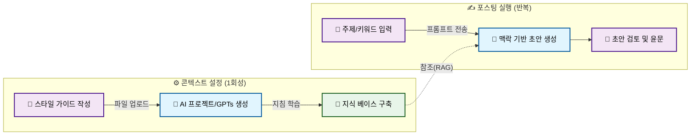
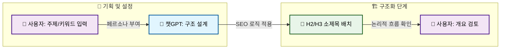

# 블로그 게시글 작성을 위한 AI 도구 활용법: 챗GPT, 클로드, 제미나이 실전 가이드

## Key Takeaways (핵심 요약)

### 실행 전략 및 파이프라인

성공적인 AI 블로그 글쓰기는 도구 의존이 아닌, **'기획(Human) → 초안(Logic AI) → 윤문(Creative AI) → 검수(Human)'**로 이어지는 정교한 파이프라인 구축에 있다. 고품질 콘텐츠 생산을 위한 3가지 핵심 전략은 다음과 같다.


### 1. '선 콘텍스트 후 프롬프트' 전략 도입
단순히 "블로그 글 써줘"라고 요청하는 제로 샷(Zero-shot) 방식은 결과물의 품질을 떨어뜨린다. 고품질 원고를 위해서는 **'선 콘텍스트 후 프롬프트(Context-First)'** 전략이 필수적이다[3].
*   **페르소나 부여:** "20년 차 개발자", "전문 마케터" 등 구체적 역할을 부여하여 톤앤매너를 설정한다.
*   **맥락 제공:** 글의 목적, 타겟 독자, 핵심 키워드 등 배경 정보를 사전에 학습시킨다. 이는 환각(Hallucination)을 줄이고 주제 적합성을 높인다.

> [!TIP]
> **프롬프트 엔지니어링 팁:** 구글 'Gemini'나 챗GPT 'Projects' 기능을 활용하여 브랜드 가이드라인이나 기존 우수 게시글을 지식 베이스로 업로드하면, 매번 맥락을 설명할 필요 없이 일관된 품질을 유지할 수 있다[3].

### 2. 도구별 강점을 활용한 '멀티 LLM' 파이프라인
단일 모델보다 각 단계에 최적화된 도구를 교차 사용하는 것이 효율적이다.
*   **기획 및 초안 (ChatGPT / Gemini):** 논리적 구조화와 데이터 처리에 강한 모델로 뼈대와 초안을 작성한다. Gemini는 구글 생태계 연동성이 뛰어나 자료 조사에 유리하다[3].
*   **윤문 및 다듬기 (Claude):** 앤스로픽의 클로드(Claude)는 한국어 뉘앙스 구현과 번역투 교정에 탁월하다[4]. 초안을 클로드에 입력하여 "블로그 이웃에게 말하듯이 수정하라"고 요청하면 가독성이 비약적으로 상승한다.

### 3. 휴먼 터치(Human-Touch)와 SEO 최적화
AI 작성 글은 SEO와 신뢰도 확보를 위해 반드시 사람의 검토가 필요하다.
*   **팩트 체크:** AI의 그럴듯한 거짓말을 방지하기 위해 인용된 통계나 사실 관계를 확인해야 한다. 미묘한 오류 판별은 사람의 몫이다[4].
*   **독자적 경험(Experience) 추가:** 구글 E-E-A-T 가이드라인 충족을 위해 AI가 흉내 낼 수 없는 필자의 실제 경험, 인사이트, 직접 촬영한 이미지를 추가한다[1]. 이는 상위 노출의 핵심 차별화 포인트다.

> [!WARNING]
> **저작권 및 중복 문서 주의:** AI 생성 글을 그대로 복사(Ctrl+C/V)할 경우 검색 엔진에서 '저품질 문서'로 분류될 위험이 있다. 반드시 자신의 문체로 재가공(Paraphrasing)하고 독자적 가치를 더해야 한다[5].

## 콘텍스트 엔지니어링: AI에게 '맥락(Context)' 부여하기

### 핵심 요약

단순 프롬프트 입력만으로는 일관된 품질 유지가 어렵다. 본 섹션에서는 AI에게 프로젝트 배경과 제약 조건을 사전 학습시키는 **'콘텍스트 엔지니어링(Context Engineering)'** 기법을 다룬다. 챗GPT의 'Projects', 'Custom Instructions' 및 스타일 가이드(Style Guide)를 활용하여 AI를 전문 에디터로 활용하는 프로세스를 제시한다.

---

### 1. 프롬프트 엔지니어링을 넘어선 '콘텍스트 엔지니어링'

단발성 요청 후 수정을 반복하는 비효율은 AI에게 **맥락(Context)**이 부재하기 때문에 발생한다. 프롬프트 엔지니어링이 '질문 기술'이라면, 콘텍스트 엔지니어링은 AI가 '무엇을, 왜, 어떻게 써야 하는지' 사전에 인지시키는 **환경 설정 기술**이다[3].

이는 AI에게 장기 기억과 유사한 배경 지식을 주입하여 반복적인 지시를 생략하고, 환각 현상을 줄이며 글의 일관성을 확보하게 한다.

> [!NOTE]
> **콘텍스트(Context)란?**
> AI 모델이 텍스트 생성 시 참조하는 배경 정보의 총체. 블로그 주제, 타겟 독자 페르소나, 브랜드 보이스, 금지어, 필수 포함 키워드 등이 포함된다.

### 2. '선(先) 콘텍스트 후(後) 프롬프트' 전략과 스타일 가이드

효과적인 작성을 위해 프롬프트 입력 전 지침서(Style Guide)를 학습시키는 **'선 콘텍스트 후 프롬프트'** 전략이 필수적이다[3]. 텍스트 지시보다 `.pdf`나 `.txt` 형식의 스타일 가이드를 업로드하여 참조하게 하는 것이 강력하다.

#### 스타일 가이드 필수 요소

| 구분 | 포함 내용 | 예시 |
| :--- | :--- | :--- |
| **톤앤매너 (Tone & Manner)** | 문체 분위기, 어미 처리 방식 | "친근하지만 전문적인 태도 유지", "~해요 체 사용" |
| **타겟 독자 (Target Audience)** | 독자 주체 및 지식 수준 | "30대 직장인, IT 용어에 익숙하지 않은 초심자" |
| **구조적 지침 (Structure)** | 서론-본론-결론 비율, 소제목 활용 | "소제목은 H2 태그 사용, 문단은 3줄 이내로 끊기" |
| **금지어 및 제약 (Constraints)** | 사용 금지 단어, 경쟁사 언급 금지 | "추상적 형용사(대박, 최고) 지양", "수동태 대신 능동태 사용" |

HubSpot의 Breeze 같은 도구도 참조 파일(Reference Files) 업로드 기능을 통해 맥락을 강화한다[5].

### 3. 도구별 콘텍스트 고정 및 구현 방법

#### A. 챗GPT 'Projects' 및 'Custom Instructions' 활용
1.  **Custom Instructions (맞춤형 지침):** 전역 설정이다. "나는 10년 차 IT 블로거다"와 같은 페르소나를 설정하면 매번 소개할 필요가 없다.
2.  **Projects (프로젝트):** 주제별 독립 작업 공간을 생성한다[3]. '기술 블로그용', '일상 에세이용' 등으로 분리하고 각 프로젝트에 맞는 지침 파일(Knowledge)을 업로드하여 간섭 없는 글쓰기가 가능하다.

#### B. 나만의 맞춤형 GPTs 생성
반복 작업이 많다면 **GPTs**를 생성하는 것이 효율적이다. 설정(Configure) 탭의 'Instructions'에 스타일 가이드를, 'Knowledge'에 기존 우수 게시글 샘플을 업로드한다. AI는 과거 글을 분석하여 문체와 구성을 모방(Few-shot Learning)한다[3].

> [!TIP]
> **클로드(Claude) 활용:** 클로드 역시 'Projects' 기능을 통해 문체나 어조 변환에 탁월하다. 긴 글 요약이나 캐주얼한 글을 공식 보고서 톤으로 바꾸는 윤문 작업에 강점이 있다[4].

### 4. 콘텍스트 기반 워크플로우



1.  **설정:** 스타일 가이드와 레퍼런스 문서를 AI(GPTs, Projects)에 업로드한다.
2.  **실행:** "이번 주 주제인 'AI 트렌드'에 대해 저장된 스타일 가이드에 맞춰 작성하라"고 요청한다.
3.  **검토:** AI는 저장된 맥락을 바탕으로 초안을 작성하며, 사용자는 사실 관계 확인과 뉘앙스 조정(Human-in-the-loop)에 집중한다[4].

## 기획 및 초안 작성: 챗GPT와 구글 제미나이 활용법

### 핵심 요약

**구글 제미나이(Gemini)**의 실시간 웹 검색 능력을 활용한 데이터 기반 기획과 **챗GPT(ChatGPT)**의 논리적 추론 능력을 결합한 하이브리드 전략을 다룬다. SEO 구조화, 분할 작성(Split Writing), 체류 시간 증대를 위한 후킹(Hooking) 기법 등 기술적 프롬프트 엔지니어링 노하우를 제시한다.

---

### 1. 기획 단계: 제미나이(Gemini)를 활용한 트렌드 및 키워드 발굴

블로그 상위 노출의 핵심은 '검색 수요가 있는 주제' 선점이다. 챗GPT는 최신 데이터 접근에 제한이 있을 수 있으나, 제미나이는 구글 검색 엔진과 연동되어 실시간 트렌드 파악에 강하다[3].

#### 제미나이 vs 챗GPT 역할 분담

| 구분 | 구글 제미나이 (Gemini) | 챗GPT (GPT-4/4o) |
| :--- | :--- | :--- |
| **핵심 강점** | 구글 검색 연동, 최신 뉴스/트렌드 파악 | 논리적 구조 설계, 자연스러운 문맥 생성 |
| **추천 단계** | 키워드 추출, 경쟁사 분석, 소재 발굴 | 개요 작성, 본문 집필, 문체 교정 |
| **데이터 소스** | 실시간 웹 데이터 | 학습된 대규모 언어 모델(LLM) 데이터 |

> [!TIP]
> **제미나이 프롬프트 예시:**
> "현재 'AI 마케팅 툴'과 관련하여 구글 트렌드 검색량이 급증하는 롱테일 키워드 5개를 추출하고, 각 키워드별 상위 노출된 경쟁 블로그 글의 제목 패턴을 분석하라."

### 2. 구조화: SEO 최적화 개요 및 소제목(H-Tag) 배치

키워드 선정 후, 챗GPT를 활용해 SEO에 유리한 구조를 잡는다. 검색 알고리즘은 논리적인 헤딩 태그(H1, H2, H3) 구조를 선호한다[2].

#### 컨텍스트 엔지니어링을 통한 개요 작성



**추천 프롬프트 구조:**
1.  **Role:** "너는 10년 차 SEO 전문 콘텐츠 마케터다."
2.  **Task:** "선정된 키워드 [키워드 삽입]를 포함하여 블로그 글 개요를 작성하라."
3.  **Constraint:** "서론-본론-결론 구조를 따르되, 본론은 반드시 H2 태그 3개와 각 하위 H3 태그 2개로 구성하라."

### 3. 집필 테크닉: 품질 저하를 막는 '분할 작성(Split Writing)'

"글 하나를 통째로 써줘"라는 요청은 AI의 토큰 제한(Token Limit)으로 인해 후반부 품질 저하를 초래한다. 내용을 3~4개 파트로 나누어 작성하는 '분할 작성'이 필수적이다[3].

#### 단계별 이어 쓰기 프로세스

1.  **전체 개요 확정:** 작성한 개요를 AI에게 인식시킨다.
2.  **섹션별 요청:** "개요의 '서론'과 '본론 1' 부분만 먼저 작성하라. 1,500자 분량으로 상세하게 서술하라."
3.  **이어 쓰기:** "이어서 '본론 2'와 '본론 3'을 작성하라. 앞부분의 톤앤매너를 유지하라."

> [!WARNING]
> **답변 오염 주의:**
> 대화가 길어지면 AI가 초기 지침을 망각할 수 있다. 챗GPT의 '프로젝트' 기능이나 제미나이의 긴 문맥 기억 기능을 활용하여 주제별로 대화창을 분리하는 것이 좋다[3].

### 4. 체류 시간 증대: 독자를 사로잡는 '후킹(Hooking)' 전략

체류 시간을 늘리기 위해서는 도입부(Intro)가 결정적이다. 단순 정보 나열이 아닌, 독자의 문제(Pain Point)를 건드리거나 호기심을 자극해야 한다[4].

#### 후킹 문구 생성을 위한 프롬프트

*   **공감형:** "독자가 겪고 있을 [문제 상황]을 묘사하며 공감을 유도하는 도입부를 작성하라."
*   **충격형:** "[주제]와 관련된 놀라운 통계나 반전 사실을 인용하여 주의를 끌어라."
*   **질문형:** "독자가 스스로를 돌아보게 만드는 질문으로 글을 시작하라."

> [!NOTE]
> **사람의 검수 필수 (Human-in-the-loop):**
> AI가 제안한 후킹 문구가 지나치게 자극적이거나(Clickbait) 현실성이 떨어질 수 있다. 작성자의 실제 경험이나 업계 현실성을 반영하여 수정해야 한다[1][4].

## 윤문과 스타일 교정: 클로드(Claude) 활용

### 핵심 요약

*   **교차 편집(Cross-Editing):** 논리적 구조화에 강한 ChatGPT로 초안을 잡고, 한국어 문맥 처리에 탁월한 Claude로 윤문하는 '하이브리드 워크플로우'가 효과적이다.
*   **톤앤매너 엔지니어링:** 구체적인 페르소나와 어조를 지정하여 기계적인 번역투를 제거한다.
*   **AI 에디터 활용:** Claude는 단순 오타 교정을 넘어 논리적 비약이나 난해한 기술 용어를 찾아내는 '편집자' 역할을 수행한다.

---

### 1. GPT와 Claude의 강점을 결합한 '교차 편집' 전략

전문적인 테크니컬 라이팅이나 마케팅 콘텐츠 작성 시 각 모델의 특성을 살린 **교차 편집(Cross-Editing)** 전략이 필수적이다.

ChatGPT(GPT-4o)는 방대한 데이터를 바탕으로 글의 뼈대를 잡는 논리적 구성력에 강점이 있다. 반면, **Anthropic의 Claude(특히 Claude 3.5 Sonnet)**는 긴 문맥(Context Window)을 이해하고, 한국어 특유의 조사 활용이나 문장 호흡을 자연스럽게 다듬는 데 우수한 성능을 보인다[4].

따라서 GPT로 초안(Draft)을 생성하고, 이를 Claude에 입력하여 다듬는 파이프라인을 구축하면 효율과 품질을 동시에 높일 수 있다.


> [!TIP]
> **Pro Tip:** Claude의 'Project' 기능을 활용하여 기존 고품질 글 3~5개를 'Knowledge'로 업로드하고, "이 스타일을 유지해서 윤문하라"고 요청하면 일관된 브랜드 보이스를 유지할 수 있다[3].

### 2. 번역투 탈피를 위한 톤(Tone)과 어조(Voice) 프롬프팅

AI 글의 문제점인 번역투나 교과서적인 문체를 해결하려면 구체적인 **지시어(Directive)**가 필요하다. 단순 요청보다 구체적 상황과 독자를 설정하는 **컨텍스트 엔지니어링**이 요구된다[3].

#### 효과적인 윤문 프롬프트 예시

| 구분 | 나쁜 프롬프트 예시 | 좋은 프롬프트 예시 (Claude 최적화) |
| :--- | :--- | :--- |
| **지시의 구체성** | "이 글을 블로그용으로 수정해줘." | "이 글을 **IT 비전공자 30대 직장인**이 읽기 쉽도록 수정하라. 전문 용어는 비유를 들어 설명하고, 문장은 **'~해요' 체**를 사용하여 친근하게 바꿔라." |
| **문체 교정** | "자연스럽게 다듬어줘." | "번역투(수동태, 대명사 남발)를 제거하고, **능동태 위주**로 문장을 재구성하라. 문장 길이를 리듬감 있게 조절하여 가독성을 높여라." |
| **구조 변경** | "요약해줘." | "도입부에는 독자의 호기심을 자극하는 질문(Hook)을 추가하고, 본문은 **소제목(H3)**을 활용해 구조화하라." |

### 3. 'AI 에디터'로서의 활용: 논리적 비약과 표현 업그레이드

윤문은 문장을 매끄럽게 만드는 것을 넘어 논리적 완성도를 높이는 과정이다. Claude를 **'냉철한 편집자'** 페르소나로 설정하여 활용할 수 있다.

1.  **논리적 검증:** "이 글에서 논리적 비약이나 근거가 부족한 부분을 지적하라."
2.  **표현의 다채로움:** "동일 단어가 반복되는 구간을 찾아 유의어로 교체하고, 더 직관적인 비유를 제안하라."
3.  **가독성 최적화:** "한 문단이 5줄을 넘어갈 경우, 가독성을 위해 문단을 나누거나 불렛포인트(Bullet points)로 정리하라."

> [!WARNING]
> **주의사항 (Human-in-the-loop)**
> AI의 수정안이 항상 정답은 아니다. 특히 기술적 내용이나 최신 트렌드 반영 시 환각(Hallucination)이 발생할 수 있다. 최종 결과물은 반드시 해당 분야 전문 지식을 가진 사람이 검수해야 한다[4].

## AI 글쓰기 SEO 전략과 필수 검토 사항

### 핵심 요약

AI 생성 콘텐츠는 훌륭한 초안이지만, 그대로 발행 시 스팸 필터에 걸리거나 신뢰를 잃을 수 있다. **'환각' 방지를 위한 팩트 체크**, **E-E-A-T 강화를 위한 인간의 개입**, **기술적 SEO 점검**은 필수적인 엔지니어링 과정이다.

---

### 1. 팩트 체크: AI 환각 현상 방지와 신뢰성 확보

AI 모델(LLM)은 확률적으로 단어를 조합하므로 존재하지 않는 통계나 출처를 조작하는 '환각 현상'이 발생할 수 있다. 무비판적 수용은 치명적 리스크가 된다[4].

#### 검증 프로세스
1.  **통계 및 수치 데이터:** 원본 보고서(PDF, 공식 웹사이트)와 대조한다.
2.  **인용구 및 사례:** 인물 발언이나 기업 사례의 실존 여부를 검색 엔진으로 교차 검증(Cross-check)한다.
3.  **하이퍼링크 유효성:** AI가 생성한 링크는 깨져 있거나 엉뚱한 곳으로 연결될 수 있다. 모든 링크를 직접 확인한다.

> [!WARNING]
> **리스크 경고**: AI는 확신에 찬 어조로 거짓 정보를 전달할 수 있다. "AI가 썼으니 맞겠지"라는 태도는 블로그 신뢰도(Trustworthiness)를 무너뜨린다.

---

### 2. E-E-A-T 전략: 경험(Experience)과 전문성(Expertise)의 20% 법칙

구글 검색 품질 평가 가이드라인 E-E-A-T에서 차별화 요소는 **경험(Experience)**이다. AI는 일반 지식(Knowledge)은 뛰어나지만, 작성자의 '실무 경험'은 생성할 수 없다. 본문 내용의 최소 20%는 작성자의 고유한 인사이트로 채워야 한다.

#### AI와 인간의 협업 워크플로우


#### 실무 적용 가이드
*   **아이디어 현실성 검토:** AI 제안 아이디어의 실무 적용 가능성을 판단한다. 예: "우리 업계는 챗봇보다 상담원 연결을 선호하므로 하이브리드 모델이 적합하다"와 같은 **현장의 맥락**을 추가한다[4].
*   **독창적 의견 추가:** 단순 정보 나열이 아닌 독창적 의견(Opinion)과 직접 수행한 조사 결과를 포함한다[1].
*   **컨텍스트 엔지니어링:** "나는 20년 차 개발자이고, 이 글은 초보자를 위한 것이다"라는 구체적 맥락을 제공하여 결과물의 결을 맞춘다[3].

---

### 3. 기술적 SEO 최적화 체크리스트

발행 전 검색 엔진 노출을 위한 기술적 요소를 점검한다. HubSpot Breeze 같은 도구가 지원하지만 최종 검수는 사람의 몫이다[5].

| 검토 항목 | AI 생성물의 특징 | SEO 최적화 수정 액션 |
| :--- | :--- | :--- |
| **키워드 밀도** | 과도한 반복(Keyword Stuffing) 또는 핵심 키워드 누락 | 메인 키워드를 상단 100자 이내 배치, 전체 분량의 1~2%로 조절 |
| **제목(H1) 및 소제목** | 포괄적이고 평이한 제목 | 검색 의도(Search Intent)를 반영한 구체적 키워드 포함 및 계층 구조(H2 > H3) 정리 |
| **이미지 및 Alt 태그** | 이미지 미생성 또는 맥락 무관 | 독창적 스크린샷/도표 추가, 파일명과 Alt 태그에 키워드 포함[1] |
| **내부/외부 링크** | 링크 부재 또는 낮은 관련성 | 자사 블로그 관련 글(내부)과 공신력 있는 자료(외부) 적절 배치 |
| **가독성** | 지나치게 긴 문장, 번역투 | 모바일 고려 3~4줄 단위 문단 분리, 불필요한 접속사 제거 |

> [!TIP]
> **Pro Tip**: "블로그 글을 3편으로 나누어 작성하라" 또는 "각 편당 1,500자 내외로 작성하라"고 지시하면 SEO에 유리한 긴 호흡의 콘텐츠를 확보할 수 있다[3].

## 자주 묻는 질문 (FAQ)

### 핵심 요약

블로그 운영자가 우려하는 **품질, 비용, 도구 선택, 저작권**에 대한 기술적 분석이다.

*   **품질:** AI 사용 여부보다 '사용자 경험'과 '독창성' 부재가 저품질의 원인이다.
*   **비용:** 무료 모델은 초안용, 문맥 유지와 추론은 유료 모델(GPT-4o, Claude 3.5)이 필수다.
*   **도구:** 자연스러운 문체는 **Claude**, 논리적 구조는 **ChatGPT**, SEO 통합은 **HubSpot Breeze**를 추천한다.
*   **저작권:** AI 생성물 자체는 저작권이 없으며, 인간의 창작적 기여가 필수다.

---

### Q. AI로 쓴 블로그 글이 저품질 블로그의 원인이 되는가?

AI 사용 자체가 문제가 아니라 **'가치 없는 콘텐츠'**가 문제다. 검색 엔진은 생성 주체(인간 vs AI)보다 콘텐츠의 **E-E-A-T**를 중시한다. AI 텍스트를 그대로 복사하는 행위는 독창성이 결여되어 저품질로 평가받을 확률이 높다[1].

반면, AI를 초안 도구로 사용하고 필자의 경험과 인사이트를 더한다면 고품질 콘텐츠로 분류된다. AI 제안 아이디어의 현실성을 검증하고 실무 경험을 덧붙이는 과정이 필수적이다[4].

> [!WARNING]
> **주의:** 검수 없는 AI 글 발행은 위험하다. 환각 현상으로 인한 거짓 정보는 블로그 신뢰도를 치명적으로 떨어뜨린다.

### Q. 무료 버전 챗GPT로도 고품질 글쓰기가 가능한가?

기본적인 글쓰기는 가능하나 **전문적인 블로그 운영에는 한계가 명확하다.** 무료 모델은 문맥 이해도(Context Window)가 낮고 한국어 뉘앙스 처리에 약점이 있다. 긴 호흡의 글이나 일관된 톤앤매너 유지 시 유료 모델과의 성능 격차가 크다.

'컨텍스트 엔지니어링'을 위해 구글 Gemini나 ChatGPT 프로젝트 기능 활용이 중요하며, 이는 유료 구독에서 온전히 활용 가능하다[3].

| 비교 항목 | 무료 모델 (Free Tier) | 유료 모델 (Plus/Pro) | 블로그 활용 추천 |
| :--- | :--- | :--- | :--- |
| **언어 모델** | GPT-4o-mini, Gemini Flash | GPT-4o, Claude 3.5 Sonnet | 유료 모델의 한국어 작문 실력이 월등함 |
| **문맥 기억** | 짧음 (앞 내용 망각) | 긺 (프로젝트 단위 관리) | 시리즈물 연재 시 유료 필수 |
| **파일 분석** | 제한적 | 대용량 PDF/데이터 분석 | 참고 자료 기반 글쓰기에 유리 |

> [!TIP]
> **Pro Tip:** 예산이 제한적이라면 무료 버전인 **Google Gemini**를 활용하라. 구글 워크스페이스 연동성이 좋고 긴 텍스트 처리에 강점이 있어 초안 작성 대안이 된다[3].

### Q. 블로그 글쓰기에 가장 적합한 AI 도구 하나만 추천한다면?

블로그 **목적과 글의 성격**에 따라 다르다. 각 도구의 특장점을 섞어 쓰는 것이 최선이다.

1.  **에세이/칼럼 (추천: Claude 3.5 Sonnet):** 한국어 작문 능력이 가장 자연스럽다. 기계적 번역투가 적고 윤문 능력이 탁월하다[4].
2.  **정보성/구조적 글쓰기 (추천: ChatGPT):** 논리적 구조 설계와 데이터 요약에 강력하다. 'Custom GPTs'로 반복 업무 자동화에 유리하다[3].
3.  **SEO 및 마케팅 (추천: HubSpot Breeze):** 기업 블로그라면 SEO 키워드 최적화, 브랜드 보이스 적용, CMS 연동을 지원하는 전문 도구가 유리하다[5].

**요약:**
*   개인 블로거(감성/후기): **Claude**
*   지식/정보 전달: **ChatGPT**
*   기업 마케터: **HubSpot Breeze** 또는 **Jasper**

### Q. AI가 쓴 글의 저작권 문제는 어떻게 되는가?

대부분 국가에서 **AI 단독 생성물은 저작권 보호 대상이 아니다.** 프롬프트로 생성된 텍스트나 이미지는 공공 영역(Public Domain)에 가깝다.

블로그 운영 시 고려할 점:
1.  **내가 쓴 글의 보호:** AI 초안에 인간이 상당한 창작적 기여(수정, 편집, 경험 추가)를 했다면, 그 **편집된 결과물**은 '2차적 저작물'로 인정받을 가능성이 높다.
2.  **타인 권리 침해:** AI가 학습 데이터의 저작권 있는 텍스트를 그대로 출력하는 경우가 드물게 발생할 수 있다. 기업용 도구는 이를 방지하기 위해 프라이버시 정책을 강화하고 있다[5].

> [!NOTE]
> **가이드:** 상업적 블로그라면 AI 생성물을 그대로 쓰기보다 재가공하거나 검증된 자료를 혼합하여 저작권 리스크를 최소화해야 한다.

---

<!-- FAQ Schema Markup -->
```html
<script type="application/ld+json">
{
  "@context": "https://schema.org",
  "@type": "FAQPage",
  "mainEntity": [
    {
      "@type": "Question",
      "name": "AI로 쓴 블로그 글이 저품질 블로그의 원인이 될까요?",
      "acceptedAnswer": {
        "@type": "Answer",
        "text": "AI 사용 자체가 저품질의 원인은 아닙니다. 검색 엔진은 콘텐츠의 생성 주체보다 E-E-A-T(경험, 전문성, 권위, 신뢰성)를 중시합니다. AI가 쓴 글을 검수 없이 그대로 발행하면 독창성이 부족해 저품질로 평가받을 수 있으나, 인간의 경험과 인사이트를 더해 가공하면 고품질 콘텐츠로 인정받습니다."
      }
    },
    {
      "@type": "Question",
      "name": "무료 버전의 챗GPT로도 충분히 고품질의 블로그 글을 쓸 수 있나요?",
      "acceptedAnswer": {
        "@type": "Answer",
        "text": "가능하지만 한계가 있습니다. 무료 모델은 문맥 기억 용량이 작고 한국어 뉘앙스 처리가 유료 모델(GPT-4o, Claude 3.5 등)에 비해 부족합니다. 전문적인 블로그 운영이나 긴 호흡의 글을 작성할 때는 유료 모델이나 구글 Gemini와 같은 대안을 활용하는 것이 효율적입니다."
      }
    },
    {
      "@type": "Question",
      "name": "블로그 글쓰기에 가장 적합한 AI 도구 하나만 추천한다면 무엇인가요?",
      "acceptedAnswer": {
        "@type": "Answer",
        "text": "목적에 따라 다릅니다. 자연스러운 문체와 에세이 작성에는 'Claude(클로드)'가 가장 적합하며, 논리적인 구조와 데이터 정리가 필요하다면 'ChatGPT'가 유리합니다. SEO와 마케팅 통합이 중요하다면 'HubSpot Breeze' 같은 전문 도구를 추천합니다."
      }
    },
    {
      "@type": "Question",
      "name": "AI가 쓴 글의 저작권 문제는 어떻게 되나요?",
      "acceptedAnswer": {
        "@type": "Answer",
        "text": "AI가 단독으로 생성한 콘텐츠는 일반적으로 저작권 보호를 받지 못합니다. 하지만 사용자가 AI 생성물에 창작적 기여(수정, 편집, 경험 추가)를 하여 완성한 글은 2차적 저작물로서 보호받을 수 있습니다. 안전한 활용을 위해 AI 결과물을 그대로 쓰기보다 반드시 재가공하는 과정을 거치는 것이 좋습니다."
      }
    }
  ]
}
</script>
```

## References
[1] 블로그 글 쓸 때 AI 도구 써? : r/marketing - Reddit: https://www.reddit.com/r/marketing/comments/1dd7u8h/do_you_use_any_ai_tools_for_writing_blogs/?tl=ko

[2] 네이버 블로그 콘텐츠 작성 챗GPT, AI 활용법과 팁: https://blog.naver.com/nkj2001/223861156212?fromRss=true&trackingCode=rss

[3] 4개월 만에 블로그 최적 3등급 만든 AI 글쓰기 방법(프롬프트 공개): https://www.youtube.com/watch?v=Qjk1X4pA0E0

[4] 브런치 대상 작가가 추천하는 글쓰기 AI툴 3개: https://brunch.co.kr/@suski/246

[5] 블로그 게시물 생성: https://knowledge.hubspot.com/ko/blog/generate-blog-posts-using-ai-assistants